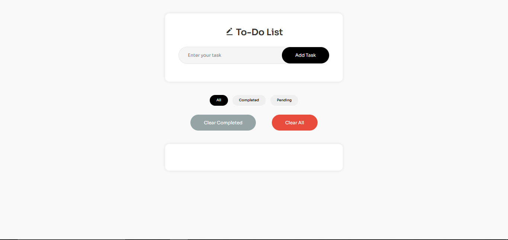

# 📝 To-Do List App

A clean and interactive To-Do List web application built with vanilla JavaScript, HTML, and CSS. This project showcases key front-end concepts including localStorage, DOM manipulation, conditional rendering, and modular UI behaviors.

---

## 🚀 Features

* Add, edit, delete tasks
* Mark tasks as completed
* Filter tasks by All / Completed / Pending
* Clear All Tasks / Clear Completed Tasks
* Animated transitions for task actions
* LocalStorage for persistent data
* Responsive design with modern UI

---

## 📂 File Overview

```
├── index.html       # App structure
├── style.css        # UI styling and animations
├── script.js        # Core app logic
└── README.md        # Project overview and explanation
```

---

## ⚙️ Key Code Sections

### 1. Add Task Logic

```js
function addTask() {
  const task = {
    id: Date.now(),
    userText: taskInput.value,
    completed: false
  };

  let tasks = JSON.parse(localStorage.getItem('tasks')) || [];
  tasks.push(task);
  localStorage.setItem('tasks', JSON.stringify(tasks));
  filterTasks();
  checkCompletedStatus();
}
```

* Creates a task object with a unique ID and default `completed` status.
* After the list from the local storge is retrieved I push the tasks to the task object using tasks.push(task), this gives the new item a unique ID stores the inputed value and the completed status.
* Saves to localStorage and refreshes the task list.

### 2. Display Tasks with Event Handlers

```js
function displayTasks(task) {
    let list = document.createElement('li')
    list.className = 'list-container'
    list.setAttribute('data-id', task.id)

    list.innerHTML = `
        <span class="task-text ${task.completed ? 'completed' : ''}">${task.userText}</span>
        <div class="btn-container">
            <i class="fa-solid fa-pen-to-square"></i>
            <i class="fa-solid fa-trash"></i>
        </div>
    `
    list.addEventListener('click', (event) => {
        if(event.target.classList.contains('fa-pen-to-square') || event.target.classList.contains('fa-trash')) {
            event.stopPropagation(); // Prevent the click from bubbling up to the list item
            return
        }

        let span = list.querySelector('.task-text')
        span.classList.toggle('completed')
        
        // Toggle the completed status in localStorage
        let tasks = JSON.parse(localStorage.getItem('tasks')) || [];
        tasks = tasks.map(t => {
            if (t.id === task.id) { // Find the task by ID
                t.completed = !t.completed; // Toggle the completed status
            }
            return t;
        })
        localStorage.setItem('tasks', JSON.stringify(tasks));
        checkCompletedStatus(); // Check if there are completed tasks to enable/disable the clear completed button
    })

    // Add event listeners for the delete and edit buttons
    list.querySelector('.fa-trash').addEventListener('click', () => {
        deleteTask(task.id)
    })

    list.querySelector('.fa-pen-to-square').addEventListener('click', () => {
        editOverlay.classList.add('show')
        taskBeingEdited = task.id
        editInput.focus()
        editInput.value = task.userText
    })

    list.style.opacity = '0';
    list.style.transform = 'translateY(-10px)';
    taskContainer.appendChild(list);

    setTimeout(() => {
       list.style.opacity = '1';
       list.style.transform = 'translateY(0)';
    }, 100);
}

closeBtn.addEventListener('click', () => {
    editOverlay.classList.remove('show')
})

editOverlay.addEventListener('click', (e) => {
    if (e.target === editOverlay) {
        editOverlay.classList.remove('show')
    }
})
```
* Added event listener on the list items to toggle completed status, I prevented accidentally clicking the edit and delete icon to toggle the completed status by validating if the icons were clicked. If they were clicked it stops propagation.
* Dynamically creates task list items.
* Handles click events for completing, editing, and deleting.

### 3. Filtering Tasks

```js
// This checks for any filtered item at the beggining if there are non it fallsback to all which would display all task
let currentFilter = localStorage.getItem('filter') || 'all'; // Default filter is 'all'

function filterTasks() {
  const tasks = JSON.parse(localStorage.getItem('tasks')) || [];
  const filtered = tasks.filter(task => {
    if (currentFilter === 'all') return true;
    if (currentFilter === 'completed') return task.completed;
    if (currentFilter === 'pending') return !task.completed;
    return !task.completed;
  });

  taskContainer.innerHTML = '';
  filtered.forEach(task => displayTasks(task));
  checkCompletedStatus();
}
```

* Filters tasks based on the active filter.
* Clears and re-renders the task list.

### 4. Clear Completed Tasks

```js
function clearCompletedTasks() {
  let tasks = JSON.parse(localStorage.getItem('tasks')) || [];
  tasks = tasks.filter(task => !task.completed);
  localStorage.setItem('tasks', JSON.stringify(tasks));
  filterTasks();
}
```

* Removes completed tasks from localStorage.

### 5. Toggle Button State Based on Task Completion

```js
function checkCompletedStatus() {
  const tasks = JSON.parse(localStorage.getItem('tasks')) || [];
  const hasCompleted = tasks.some(task => task.completed);
  clearCompletedBtn.disabled = !hasCompleted;
}
```

* Uses `.some()` to check if at least one task is completed.
* Disables/enables the "Clear Completed" button accordingly.

---

## 🧠 Challenges Faced

### 1. **Filter State Persistence**

Storing the active filter in `localStorage` was necessary to ensure it persists between page reloads.

### 2. **DOM Animations**

Coordinating CSS transitions with `setTimeout()` required careful timing to make animations smooth without breaking task logic.

### 3. **Task Editing Overlay**

Managing focus and input validation within the overlay modal added complexity but improved UX significantly.

### 4. **Syncing UI with localStorage**

Updating the DOM in sync with stored task states (especially on edit/delete/clear) was essential to maintain UI consistency.

---

## 📸 Screenshots



---

## 🌐 Live Demo 

[Click here to view the live To-Do List](https://shippudden.github.io/To-Do-List/)

---

## Demo

[View Demo](https://www.linkedin.com/posts/boluwatife-david-640089309_heres-the-demo-for-the-to-do-list-activity-7357698921252511744-iImC?utm_source=share&utm_medium=member_desktop&rcm=ACoAAE5_2FAB0wo1rn6rJQf0zoPi2aEP6E7PX_Y)

## 📌 Author Notes

This project is part of a personal learning journey to build real-world apps with pure JavaScript. Clean UI/UX and maintainable code were primary goals.

---

## 📬 Feedback

Feel free to submit an issue or reach out with suggestions!

---

**License:** MIT
